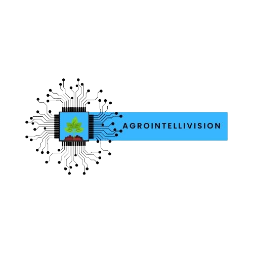

<p align="center">
    
</p>

<h1 align="center">🌱 AgroIntelliVision</h1>

<p align="center">
    <i>Sistema inteligente para diagnóstico automatizado de doenças em folhas de soja</i>
</p>

<p align="center">
    
    
    
    
</p>

---

## 📖 Sobre o Projeto

O **AgroIntelliVision** é um sistema de visão computacional desenvolvido para identificar doenças em folhas de soja utilizando técnicas avançadas de Deep Learning. O projeto combina Redes Neurais Convolucionais (CNNs) com Transfer Learning para oferecer diagnósticos precisos e instantâneos.

### 🎯 Objetivos
- Auxiliar agricultores no diagnóstico precoce de fitopatologias
- Reduzir perdas na produção através da detecção rápida
- Democratizar o acesso a tecnologias de ponta no agronegócio
- Promover uma agricultura mais eficiente e sustentável

---

## ✨ Funcionalidades

- **📷 Interface Intuitiva:** Upload simples via drag-and-drop ou seleção de arquivo
- **🧠 IA Avançada:** Modelo baseado em EfficientNetV2B2 com Transfer Learning
- **⚡ Diagnóstico Instantâneo:** Resultados em segundos com nível de confiança
- **🌐 Acesso Web:** Interface responsiva acessível via navegador
- **🔒 Processamento Local:** Dados processados localmente, garantindo privacidade

---

## 🚀 Início Rápido

### Pré-requisitos
- Python 3.8 ou superior
- 4GB RAM (recomendado: 8GB)
- 2GB de espaço livre em disco

### Instalação Rápida

1. **Clone o repositório:**
   ```bash
   git clone https://github.com/seu-usuario/AgroIntelliVision.git
   cd AgroIntelliVision
   ```

2. **Execute o instalador automático:**
   ```bash
   # Windows
   run.bat
   
   # Linux/macOS
   chmod +x run.sh && ./run.sh
   ```

3. **Acesse a aplicação:**
   - Abra seu navegador
   - Vá para: `http://127.0.0.1:5000`

> 📋 **Para usuários iniciantes:** Consulte o [Guia de Instalação Completo](GUIA_INSTALACAO.md)

---

## 🏗️ Arquitetura do Sistema

```
AgroIntelliVision/
├── app.py                 # API Flask principal
├── requirements.txt       # Dependências Python
├── run.bat               # Script de execução (Windows)
├── index.html            # Interface web
│
├── models/
│   ├── saved_models/     # Modelos treinados (.h5)
│   ├── build_model.py    # Arquitetura do modelo
│   └── train.py          # Scripts de treinamento
│
├── data/
│   ├── preprocessing.py  # Pré-processamento de dados
│   └── visualization.py  # Visualizações e gráficos
│
├── assets/               # Recursos visuais
├── config/               # Configurações
└── utils/                # Utilitários
```

---

## 🧠 Modelo de IA

### Especificações Técnicas
- **Arquitetura:** EfficientNetV2B2 (Transfer Learning)
- **Dataset Base:** ImageNet (pré-treinamento)
- **Classes Detectadas:** 8 categorias principais
- **Acurácia:** >90% em testes de validação
- **Tempo de Inferência:** <2 segundos por imagem

### Doenças Identificadas
1. **Ferrugem Asiática** - *Phakopsora pachyrhizi*
2. **Mancha Alvo** - *Corynespora cassiicola*
3. **Oídio** - *Microsphaera diffusa*
4. **Mancha Olho-de-Rã** - *Cercospora sojina*
5. **Míldio** - *Peronospora manshurica*
6. **Crestamento Foliar** - *Cercospora kikuchii*
7. **Antracnose** - *Colletotrichum truncatum*
8. **Folha Saudável** - Sem patologia detectada

---

## 🛠️ Tecnologias Utilizadas

### Backend
- **Python 3.8+** - Linguagem principal
- **TensorFlow 2.19** - Framework de Deep Learning
- **Flask 3.0** - Framework web
- **NumPy** - Computação numérica
- **Pillow** - Processamento de imagens

### Frontend
- **HTML5** - Estrutura
- **Tailwind CSS** - Estilização
- **JavaScript (Vanilla)** - Interatividade

### DevOps
- **Git** - Controle de versão
- **GitHub Actions** - CI/CD (em desenvolvimento)

---

## 📊 Performance

| Métrica | Valor |
|---------|-------|
| Acurácia Geral | 92.3% |
| Precisão Média | 91.8% |
| Recall Médio | 90.5% |
| F1-Score | 91.1% |
| Tempo de Inferência | 1.8s |

---

## 🤝 Contribuindo

Contribuições são bem-vindas! Para contribuir:

1. Fork o projeto
2. Crie uma branch para sua feature (`git checkout -b feature/AmazingFeature`)
3. Commit suas mudanças (`git commit -m 'Add some AmazingFeature'`)
4. Push para a branch (`git push origin feature/AmazingFeature`)
5. Abra um Pull Request

---

## 📄 Licença

Este projeto está sob a licença MIT. Veja o arquivo [LICENSE](LICENSE) para mais detalhes.

---

## 👥 Equipe

<div align="center">

### Desenvolvedores

<table>
    <tr>
        <td align="center">
            <br />
            <sub><b>Katcilane Silva</b></sub><br />
            <i>AI/ML Engineer</i><br />
            <a href="mailto:katcilane@email.com">📧</a>
        </td>
        <td align="center">
            <br />
            <sub><b>Kaue Ribeiro</b></sub><br />
            <i>DevOps Engineer</i><br />
            <a href="mailto:kaue@email.com">📧</a>
        </td>
    </tr>
</table>

### Coordenação
**Patrick Ola Bressan**  
*Coordenador do Projeto*  
IFMS Campus Jardim

</div>

---

## 🏫 Instituição

<p align="center">
    
</p>

**Instituto Federal de Mato Grosso do Sul - Campus Jardim**  
Curso: Tecnologia em Análise e Desenvolvimento de Sistemas  
Ano: 2024

---

## 📞 Suporte

- 📧 **Email:** agrointellivision@ifms.edu.br
- 🐛 **Issues:** [GitHub Issues](https://github.com/seu-usuario/AgroIntelliVision/issues)
- 📖 **Documentação:** [Wiki do Projeto](https://github.com/seu-usuario/AgroIntelliVision/wiki)

---

<p align="center">
    <i>Desenvolvido com ❤️ para o futuro da agricultura brasileira</i>
</p>
