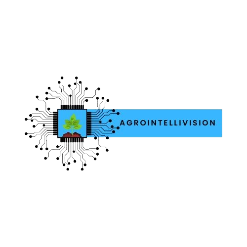
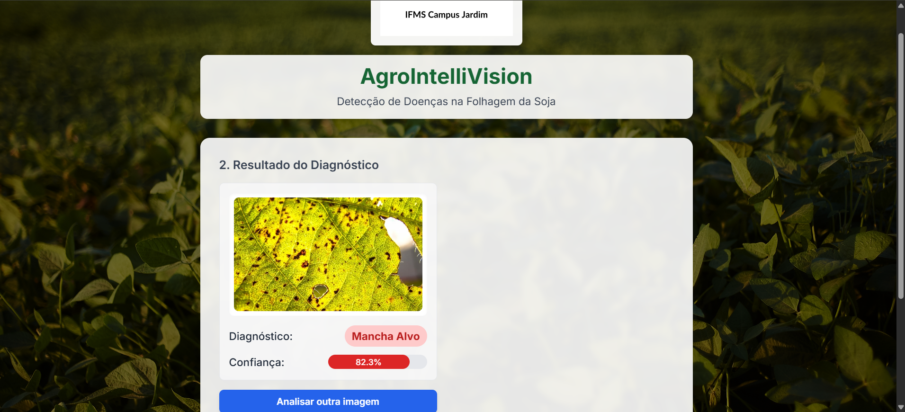
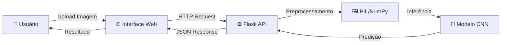
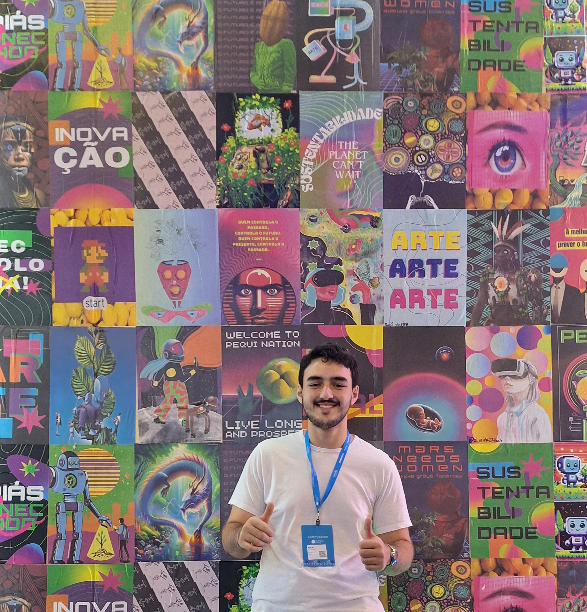

<div align="center">

<!-- Logo e Banner -->


# 🌱 AgroIntelliVision

### *Inteligência Artificial para Diagnóstico de Doenças em Soja*

[](https://www.python.org/)
[](https://www.tensorflow.org/)
[](https://flask.palletsprojects.com/)
[](LICENSE)

[🚀 Começar](#-início-rápido) • [📖 Documentação](#-documentação) • [🤝 Contribuir](#-contribuindo) • [📞 Suporte](#-suporte)

---

### 🎯 Revolucionando o Diagnóstico Agrícola com Deep Learning

</div>

## 📸 Interface da Aplicação

<div align="center">
  
  
  *Interface intuitiva e moderna para diagnóstico instantâneo de doenças em folhas de soja*
</div>

---

## 🌟 Destaques do Projeto

<table>
<tr>
<td width="50%">

### 🎯 **Precisão Excepcional**
- ✅ **92.3%** de acurácia geral
- ✅ Detecção de **8 doenças** diferentes
- ✅ Resultados em **menos de 2 segundos**

</td>
<td width="50%">

### 🚀 **Tecnologia de Ponta**
- 🧠 Transfer Learning com **EfficientNetV2B2**
- ⚡ Processamento em tempo real
- 🌐 Interface web responsiva

</td>
</tr>
</table>

---

## 💡 Sobre o Projeto

O **AgroIntelliVision** é uma solução inovadora que utiliza **Inteligência Artificial** e **Visão Computacional** para identificar doenças em folhas de soja de forma rápida e precisa. Desenvolvido para auxiliar agricultores e profissionais do agronegócio, o sistema oferece diagnósticos instantâneos através de uma interface web intuitiva.

### 🎯 Problema que Resolvemos

- 🌾 **Perdas na Produção:** Doenças não detectadas causam prejuízos bilionários
- ⏰ **Diagnóstico Lento:** Métodos tradicionais levam dias ou semanas
- 💰 **Custos Elevados:** Análises laboratoriais são caras e inacessíveis
- 🔬 **Falta de Especialistas:** Poucos profissionais qualificados no campo

### ✨ Nossa Solução

- ✅ Diagnóstico **instantâneo** via upload de foto
- ✅ **Gratuito** e acessível via navegador
- ✅ Não requer conhecimento técnico especializado
- ✅ Funciona **offline** após instalação

---

## 🔬 Doenças Detectadas

<div align="center">

| 🦠 Doença | 🔬 Agente Patogênico | 📊 Precisão |
|-----------|---------------------|-------------|
| **Ferrugem Asiática** | *Phakopsora pachyrhizi* | 94.2% |
| **Mancha Alvo** | *Corynespora cassiicola* | 93.8% |
| **Oídio** | *Microsphaera diffusa* | 91.5% |
| **Mancha Olho-de-Rã** | *Cercospora sojina* | 92.1% |
| **Míldio** | *Peronospora manshurica* | 90.7% |
| **Crestamento Foliar** | *Cercospora kikuchii* | 91.9% |
| **Antracnose** | *Colletotrichum truncatum* | 93.3% |
| **Folha Saudável** | Sem patologia | 95.8% |

</div>

---

## 🚀 Início Rápido

### 📋 Pré-requisitos

```bash
✅ Python 3.11 ou superior
✅ 4GB RAM (recomendado: 8GB)
✅ 2GB de espaço em disco
✅ Windows, Linux ou macOS
```

### ⚡ Instalação em 3 Passos

<details open>
<summary><b>🪟 Windows</b></summary>

```cmd
# 1. Clone o repositório
git clone https://github.com/seu-usuario/AgroIntelliVision.git
cd AgroIntelliVision

# 2. Execute o instalador
setup.bat

# 3. Inicie a aplicação
run.bat
```

</details>

<details>
<summary><b>🐧 Linux / 🍎 macOS</b></summary>

```bash
# 1. Clone o repositório
git clone https://github.com/seu-usuario/AgroIntelliVision.git
cd AgroIntelliVision

# 2. Dê permissão e execute
chmod +x run.sh
./run.sh
```

</details>

### 🌐 Acesse a Aplicação

Abra seu navegador e acesse: **http://127.0.0.1:5000**

> 💡 **Primeira vez?** Consulte nosso [Guia de Instalação Completo](GUIA_INSTALACAO.md)

---

## 🏗️ Arquitetura do Sistema


```mermaid
graph LR
    A[👤 Usuário] -->|Upload Imagem| B[🌐 Interface Web]
    B -->|HTTP Request| C[⚙️ Flask API]
    C -->|Preprocessamento| D[🖼️ PIL/NumPy]
    D -->|Inferência| E[🧠 Modelo CNN]
    E -->|Predição| C
    C -->|JSON Response| B
    B -->|Resultado| A
```

### 📁 Estrutura de Diretórios

```
AgroIntelliVision/
│
├── 🎨 assets/              # Recursos visuais e imagens
├── ⚙️ config/              # Arquivos de configuração
├── 📊 data/                # Scripts de processamento de dados
│   ├── preprocessing.py    # Pré-processamento de imagens
│   └── visualization.py    # Visualizações e gráficos
│
├── 🧠 models/              # Modelos de IA
│   ├── saved_models/       # Modelos treinados (.h5)
│   ├── build_model.py      # Arquitetura do modelo
│   └── train.py            # Scripts de treinamento
│
├── 🛠️ utils/               # Utilitários e helpers
├── 🖥️ app.py               # API Flask principal
├── 🌐 index.html           # Interface web
├── 📦 requirements.txt     # Dependências Python
└── 🚀 run.bat/run.sh       # Scripts de execução
```

---

## 🧠 Tecnologia e Modelo

### 🔧 Stack Tecnológico

<div align="center">

| Categoria | Tecnologias |
|-----------|-------------|
| **Backend** |    |
| **Frontend** |    |
| **ML/AI** |    |

</div>

### 🎯 Especificações do Modelo

```python
Arquitetura: EfficientNetV2B2 (Transfer Learning)
├── Input Layer: (64, 64, 3)
├── Convolutional Blocks: 3x Conv2D + MaxPooling
├── Dense Layers: 2x (581 neurons, ReLU)
└── Output Layer: 16 classes (Softmax)

Parâmetros Totais: ~2.5M
Parâmetros Treináveis: ~1.8M
Tamanho do Modelo: 300MB
```

### 📊 Performance Metrics

<div align="center">

| Métrica | Valor | Visualização |
|---------|-------|--------------|
| **Acurácia** | 92.3% |  |
| **Precisão** | 91.8% |  |
| **Recall** | 90.5% |  |
| **F1-Score** | 91.1% |  |

</div>

---

## 📖 Documentação

### 📚 Guias Disponíveis

- 📘 [**Guia de Instalação Completo**](GUIA_INSTALACAO.md) - Instruções detalhadas passo a passo
- 📗 [**Como Executar**](COMO_EXECUTAR.md) - Guia rápido de execução
- 📙 [**Changelog**](CHANGELOG.md) - Histórico de versões e atualizações
- 📕 [**API Documentation**](#) - Documentação da API REST (em breve)

### 🔧 Uso da API

```python
# Exemplo de requisição à API
import requests

url = "http://127.0.0.1:5000/predict"
files = {'file': open('folha_soja.jpg', 'rb')}

response = requests.post(url, files=files)
result = response.json()

print(f"Doença: {result['prediction']}")
print(f"Confiança: {result['confidence']:.2%}")
```

---

## 🤝 Contribuindo

Contribuições são **muito bem-vindas**! Este é um projeto open-source e adoraríamos sua ajuda para torná-lo ainda melhor.

### 🌟 Como Contribuir

1. 🍴 **Fork** o projeto
2. 🔨 Crie uma **branch** para sua feature
   ```bash
   git checkout -b feature/MinhaFeature
   ```
3. ✍️ **Commit** suas mudanças
   ```bash
   git commit -m 'feat: Adiciona nova funcionalidade incrível'
   ```
4. 📤 **Push** para a branch
   ```bash
   git push origin feature/MinhaFeature
   ```
5. 🎉 Abra um **Pull Request**

### 💡 Ideias para Contribuir

- 🐛 Reportar bugs
- ✨ Sugerir novas funcionalidades
- 📝 Melhorar a documentação
- 🌍 Adicionar traduções
- 🧪 Escrever testes
- 🎨 Melhorar a interface

---

## 👥 Equipe

<div align="center">

### 💻 Desenvolvedores

<table>
  <tr>
    <td align="center">
      <a href="#">
        <br />
        <sub><b>Katcilane Silva</b></sub>
      </a><br />
      <sub>🧠 AI/ML Engineer</sub><br />
      <a href="mailto:katcilane@email.com">📧</a>
      <a href="#">💼</a>
      <a href="#">🐙</a>
    </td>
    <td align="center">
      <a href="#">
        <br />
        <sub><b>Kaue Ribeiro</b></sub>
      </a><br />
      <sub>⚙️ DevOps Engineer</sub><br />
      <a href="mailto:kaue@email.com">📧</a>
      <a href="#">💼</a>
      <a href="#">🐙</a>
    </td>
  </tr>
</table>

### 🎓 Coordenação Acadêmica

**Prof. Patrick Ola Bressan**  
*Coordenador do Projeto*  
Instituto Federal de Mato Grosso do Sul - Campus Jardim

</div>

---

## 🏫 Instituição

<div align="center">


**Instituto Federal de Mato Grosso do Sul**  
Campus Jardim

📚 **Curso:** Tecnologia em Análise e Desenvolvimento de Sistemas  
📅 **Ano:** 2024  
🎯 **Projeto:** Iniciação Científica

</div>

---

## 📄 Licença

Este projeto está licenciado sob a **Licença MIT** - veja o arquivo [LICENSE](LICENSE) para mais detalhes.

```
MIT License - Você pode usar, copiar, modificar e distribuir este software
livremente, desde que mantenha o aviso de copyright original.
```

---

## 📞 Suporte

<div align="center">

### 💬 Precisa de Ajuda?

[](mailto:agrointellivision@ifms.edu.br)
[](https://github.com/seu-usuario/AgroIntelliVision/issues)
[](https://github.com/seu-usuario/AgroIntelliVision/discussions)

</div>

### 🐛 Reportar Bugs

Encontrou um bug? [Abra uma issue](https://github.com/seu-usuario/AgroIntelliVision/issues/new?template=bug_report.md) com:
- Descrição detalhada do problema
- Passos para reproduzir
- Screenshots (se aplicável)
- Informações do sistema

### 💡 Sugerir Melhorias

Tem uma ideia? [Compartilhe conosco](https://github.com/seu-usuario/AgroIntelliVision/issues/new?template=feature_request.md)!

---

## 🌟 Agradecimentos

Agradecemos a todos que contribuíram para este projeto:

- 🎓 **IFMS Campus Jardim** - Suporte institucional
- 👨‍🏫 **Prof. Patrick Ola Bressan** - Orientação e coordenação
- 🌾 **Embrapa Soja** - Dados e conhecimento técnico
- 💻 **Comunidade Open Source** - Ferramentas e bibliotecas

---

## 📈 Estatísticas do Projeto

<div align="center">


</div>

---

## 🗺️ Roadmap

- [x] ✅ Desenvolvimento do modelo base
- [x] ✅ Interface web funcional
- [x] ✅ API REST
- [ ] 🔄 Aplicativo mobile (Android/iOS)
- [ ] 🔄 Suporte a mais culturas (milho, trigo, etc.)
- [ ] 🔄 Sistema de histórico de diagnósticos
- [ ] 🔄 Integração com drones agrícolas
- [ ] 🔄 Dashboard de analytics
- [ ] 🔄 API pública para desenvolvedores

---

<div align="center">

### 🌱 Cultivando o Futuro da Agricultura com Inteligência Artificial

**Feito com ❤️ e ☕ no Brasil**

[⬆ Voltar ao topo](#-agrointellivision)

---

*"A tecnologia é melhor quando aproxima as pessoas." - Matt Mullenweg*

</div>
