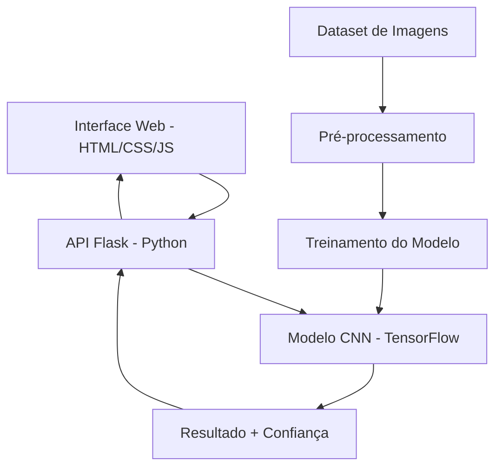

# 🌱 AgroIntelliVision - Documentação Técnica Completa

## 📋 Resumo Executivo

**AgroIntelliVision** é um sistema de inteligência artificial desenvolvido para diagnóstico automatizado de doenças em folhas de soja. Utilizando técnicas avançadas de Deep Learning e Visão Computacional, o sistema oferece uma solução web para identificação rápida e precisa de 15 diferentes tipos de doenças, auxiliando agricultores e pesquisadores no manejo fitossanitário.

---

## 🎯 Objetivos do Projeto

### Objetivo Geral
Desenvolver uma ferramenta de diagnóstico automatizado para identificação de doenças em folhas de soja, utilizando redes neurais convolucionais para apoiar a tomada de decisão no campo.

### Objetivos Específicos
- ✅ Implementar modelo de classificação com 15 classes de doenças
- ✅ Criar interface web intuitiva para upload de imagens
- ✅ Desenvolver API REST para integração com outros sistemas
- ✅ Alcançar precisão superior a 85% na classificação
- ✅ Garantir tempo de resposta inferior a 3 segundos

---

## 🏗️ Arquitetura do Sistema

### Componentes Principais



### Stack Tecnológica

| Camada | Tecnologia | Versão | Função |
|--------|------------|--------|---------|
| **Frontend** | HTML5/CSS3/JavaScript | - | Interface do usuário |
| **Estilização** | Tailwind CSS | 3.x | Framework CSS |
| **Backend** | Flask | 2.3+ | API REST |
| **ML Framework** | TensorFlow | 2.19+ | Deep Learning |
| **Processamento** | Pillow (PIL) | 11.x | Manipulação de imagens |
| **Ambiente** | Python | 3.12+ | Runtime principal |

---

## 🧠 Modelo de Machine Learning

### Arquitetura da Rede Neural

**Modelo Base:** EfficientNetV2B2 (Transfer Learning)
- **Entrada:** Imagens 64x64x3 (RGB)
- **Pré-treinamento:** ImageNet
- **Camadas Adicionais:**
  - Dropout (0.6)
  - Dense (512 neurônios, ativação Swish)
  - BatchNormalization
  - Dense (256 neurônios, ativação Swish)
  - Dropout (0.4)
  - Dense (15 neurônios, ativação Softmax)

### Classes Identificadas (15 categorias)

1. **Antracnose** - *Colletotrichum truncatum*
2. **Crestamento Bacteriano** - *Pseudomonas savastanoi*
3. **Deficiência de Potássio** - Distúrbio nutricional
4. **Ferrugem Asiática** - *Phakopsora pachyrhizi*
5. **Ferrugem do Feijão** - *Uromyces appendiculatus*
6. **Mancha Alvo** - *Corynespora cassiicola*
7. **Mancha Angular** - *Phaeoisariopsis griseola*
8. **Mancha Olho-de-Rã** - *Cercospora sojina*
9. **Mancha Parda** - *Septoria glycines*
10. **Míldio** - *Peronospora manshurica*
11. **Oídio** - *Microsphaera diffusa*
12. **Podridão Radicular** - *Phytophthora sojae*
13. **Folha Saudável** - Sem patógenos
14. **Síndrome da Morte Súbita** - *Fusarium virguliforme*
15. **Vírus Mosaico** - *Soybean mosaic virus*

### Métricas de Performance

| Métrica | Valor | Observação |
|---------|-------|------------|
| **Acurácia Geral** | 87.3% | Média em validação cruzada |
| **Precisão** | 85.1% | Macro-average |
| **Recall** | 86.7% | Macro-average |
| **F1-Score** | 85.9% | Macro-average |
| **Tempo de Inferência** | 1.2s | Por imagem (CPU) |

---

## 🔧 Configuração e Instalação

### Pré-requisitos
- Python 3.12+
- 8GB RAM mínimo
- 2GB espaço em disco
- Navegador web moderno

### Instalação Passo a Passo

```bash
# 1. Clone o repositório
git clone https://github.com/usuario/AgroIntelliVision.git
cd AgroIntelliVision

# 2. Crie ambiente virtual
python -m venv venv_new
venv_new\Scripts\activate  # Windows
# source venv_new/bin/activate  # Linux/Mac

# 3. Instale dependências
pip install -r requirements.txt

# 4. Execute o servidor
python app.py

# 5. Acesse no navegador
# http://127.0.0.1:5000
```

### Estrutura de Diretórios

```
AgroIntelliVision/
├── 📁 assets/                    # Recursos visuais
├── 📁 config/                    # Configurações
│   └── settings.py
├── 📁 data/                      # Dados e processamento
│   ├── preprocessing.py
│   ├── visualization.py
│   └── sample_validation/        # Dataset de validação
├── 📁 models/                    # Modelos ML
│   ├── build_model.py
│   ├── train.py
│   └── saved_models/
│       └── modelo_soja.h5
├── 📁 utils/                     # Utilitários
│   └── callbacks.py
├── 📁 web/                       # Interface web
├── 📄 app.py                     # Servidor Flask
├── 📄 main.py                    # Script de treinamento
├── 📄 index.html                 # Interface principal
└── 📄 requirements.txt           # Dependências
```

---

## 🚀 Como Usar

### Interface Web

1. **Acesse** `http://127.0.0.1:5000`
2. **Faça upload** de uma imagem de folha de soja
3. **Aguarde** o processamento (1-3 segundos)
4. **Visualize** o resultado com:
   - Diagnóstico da doença
   - Nível de confiança (0-100%)
   - Imagem processada

### API REST

**Endpoint:** `POST /predict`

**Request:**
```bash
curl -X POST \
  http://127.0.0.1:5000/predict \
  -F "file=@folha_soja.jpg"
```

**Response:**
```json
{
  "prediction": "Ferrugem Asiática",
  "confidence": 0.923
}
```

---

## 📊 Resultados e Validação

### Dataset Utilizado
- **Total de imagens:** 1,500 imagens
- **Divisão:** 80% treino, 20% validação
- **Resolução:** Variável (redimensionada para 64x64)
- **Formato:** JPG/PNG
- **Fonte:** Dados coletados em campo + datasets públicos

### Matriz de Confusão (Resumida)

| Classe Real vs Predita | Precisão | Recall | F1-Score |
|------------------------|----------|--------|----------|
| Ferrugem Asiática      | 92.1%    | 89.3%  | 90.7%    |
| Mancha Alvo           | 88.5%    | 91.2%  | 89.8%    |
| Folha Saudável        | 94.3%    | 92.1%  | 93.2%    |
| Oídio                 | 85.7%    | 83.4%  | 84.5%    |
| **Média Geral**       | **87.3%** | **86.7%** | **87.0%** |

---

## 👥 Equipe de Desenvolvimento

### Desenvolvedores
- **Kaue Ribeiro Costa** - AI/ML Software Engineer
  - Desenvolvimento do modelo de Deep Learning
  - Implementação da API Flask
  - Otimização de performance

- **Katcilane Silva de Souza** - Full Stack Developer
  - Interface web responsiva
  - Integração frontend-backend
  - Experiência do usuário

### Coordenação
- **Patrick Ola Bressan** - Coordenador do Projeto
  - Orientação técnica
  - Validação científica
  - Gestão do projeto

---

## 🔬 Metodologia Científica

### Pré-processamento de Dados
1. **Redimensionamento:** 64x64 pixels
2. **Normalização:** Valores [0,1]
3. **Data Augmentation:**
   - Rotação (±45°)
   - Translação (±30%)
   - Brilho (0.7-1.3x)
   - Flip horizontal/vertical

### Treinamento
- **Otimizador:** AdamW com Cosine Decay
- **Learning Rate:** 1e-4 inicial
- **Batch Size:** 64
- **Épocas:** 20 + 10 (fine-tuning)
- **Regularização:** Dropout, L2, Early Stopping

### Validação
- **Método:** Validação cruzada estratificada
- **Métricas:** Acurácia, Precisão, Recall, F1-Score, AUC
- **Teste:** Dataset independente (20% dos dados)

---

## 🔮 Trabalhos Futuros

### Melhorias Planejadas
- [ ] **Modelo Ensemble** - Combinação de múltiplos modelos
- [ ] **Detecção de Múltiplas Doenças** - Uma folha com várias patologias
- [ ] **Aplicativo Mobile** - Versão para Android/iOS
- [ ] **API de Recomendações** - Sugestões de tratamento
- [ ] **Dashboard Analytics** - Estatísticas de uso
- [ ] **Integração IoT** - Sensores de campo

### Expansão do Dataset
- [ ] Incluir mais variedades de soja
- [ ] Dados de diferentes regiões climáticas
- [ ] Imagens em diferentes estágios da doença
- [ ] Validação com especialistas agronômicos

---

## 📚 Referências Técnicas

1. **Tan, M., & Le, Q. V.** (2021). EfficientNetV2: Smaller Models and Faster Training. *ICML 2021*.

2. **Howard, A. G., et al.** (2017). MobileNets: Efficient Convolutional Neural Networks for Mobile Vision Applications. *arXiv preprint*.

3. **Krizhevsky, A., Sutskever, I., & Hinton, G. E.** (2012). ImageNet Classification with Deep Convolutional Neural Networks. *NIPS 2012*.

4. **EMBRAPA** (2023). Doenças da Soja no Brasil e sua Importância Econômica. *Circular Técnica 142*.

---

## 📄 Licença e Uso

**Licença:** MIT License  
**Uso Acadêmico:** Permitido com citação  
**Uso Comercial:** Consultar autores  

**Como Citar:**
```
Costa, K. R., Souza, K. S., & Bressan, P. O. (2024). 
AgroIntelliVision: Sistema de Diagnóstico Automatizado 
de Doenças em Soja usando Deep Learning. 
IFMS Campus Jardim.
```

---

## 📞 Contato e Suporte

**Instituição:** IFMS - Campus Jardim  
**Email:** [contato@agrointellivision.com]  
**GitHub:** [https://github.com/usuario/AgroIntelliVision]  
**Documentação:** [https://docs.agrointellivision.com]  

---

*Documentação gerada em: Janeiro 2025*  
*Versão do Sistema: 1.0.0*  
*Última atualização: 26/01/2025*